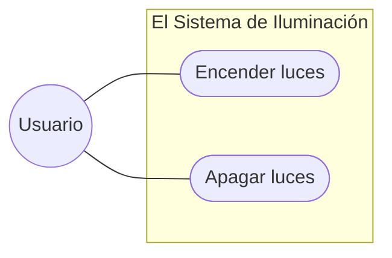

# Entornos-7.2

```mermaid
graph LR 

%%Este es el actor
Usuario((Usuario)) 

subgraph "El Sistema de Iluminación"
   
    CU1([Encender luces])
    CU2([Apagar luces])
end

%% Relaciones entre el actor y los casos de uso
Usuario --- CU1
Usuario --- CU2

```
