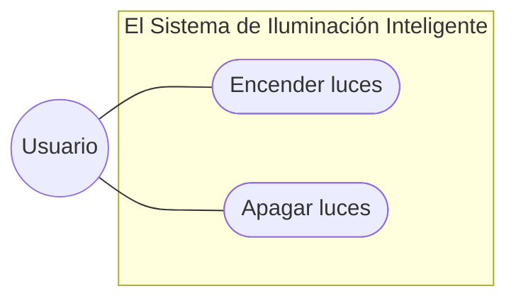

# Entornos-7.2



```mermaid
graph LR

%% Estos son los actores
Cliente ((Cliente))
Admin ((Administrador))

subgraph "Gestión de Tienda Online"

%% Casos de Uso
CU1 ([Comprar producto])
CU2 ([Aplicar Cupón descuento])
CU3 ([Gestionar Stock])

CU2 -.->|&lt;&lt;extend&gt;&gt;| CU1
end

%% Relación de los actores y los casos de uso
Cliente --- CU1
Admin --- CU3

```


```

